# ICS/OT Anomaly Detection — ICSSim v2

> **Core argument:** A network-layer replay attack against an ICS is undetectable to both a network-flow ML classifier and a physical-layer anomaly detector — simultaneously, by design — because it operates inside the bounds both systems were built to recognise as normal. This repo builds the full pipeline, measures each failure precisely, then closes the gap with cross-layer feature fusion.

This is a learning document as much as a codebase. Every chart has an explanation, every design decision has a justification, and every result has an interpretation. The goal is that you can close this repo for six months, reopen it, and rebuild the reasoning from scratch.

---

## Table of Contents

1. [The Security Context](#the-security-context)
2. [Dataset](#dataset)
3. [The Four-Act Story](#the-four-act-story)
4. [Sprint 1 — EDA + Statistical Analysis (01, 02, 03)](#sprint-1--eda--statistical-analysis)
   - [Charts: Histograms, Correlation, Mann-Whitney, Chi-Square, Regression, PCA, Cronbach](#chart-explanations)
   - [Core Finding: Replay is Invisible](#core-finding--replay-is-invisible)
5. [Sprint 2 — Unsupervised Clustering + Bedrock (04)](#sprint-2--unsupervised-clustering--bedrock)
   - [Why unsupervised first?](#why-unsupervised-first)
   - [Algorithm selection and why](#algorithm-selection-and-why)
   - [The OOM engineering problem](#the-oom-engineering-problem)
   - [AWS Bedrock: Titan Embeddings + Claude zero-shot](#aws-bedrock-titan-embeddings--claude)
   - [Charts and results](#04-charts-and-results)
6. [Sprint 3 — Supervised Classifier (05)](#sprint-3--supervised-classifier)
   - [Why macro-F1 and not accuracy](#why-macro-f1-and-not-accuracy)
   - [Random Forest vs LightGBM](#random-forest-vs-lightgbm)
   - [Claude zero-shot baseline](#claude-zero-shot-baseline--the-null-result)
   - [Charts and results](#05-charts-and-results)
7. [Sprint 4 — Streaming Anomaly Detection (06)](#sprint-4--streaming-anomaly-detection)
   - [The streaming design](#the-streaming-design)
   - [Variance collapse: the replay signature](#variance-collapse-the-replay-signature)
   - [Why 93% recall with zero labels](#why-93-recall-with-zero-labels)
   - [Charts and results](#06-charts-and-results)
8. [Sprint 5 — Cross-Layer Fusion (07)](#sprint-5--cross-layer-fusion)
   - [The hypothesis](#the-hypothesis)
   - [Data alignment: the 7200-second finding](#data-alignment-the-7200-second-finding)
   - [Time-bucket join design](#time-bucket-join-design)
   - [Results: +45 points replay recall](#results-the-headline-numbers)
   - [Why LGB beats RF on fused data](#why-lgb-beats-rf-on-fused-data)
   - [The DDoS surprise](#the-ddos-surprise)
   - [Charts and results](#07-charts-and-results)
9. [Kaggle Notebook — Interactive Analysis Companion](#kaggle-notebook--interactive-analysis-companion)
10. [Rigid Methodology](#rigid-methodology)
11. [Setup & Run](#setup--run)
12. [Related Work](#related-work)

---

## The Security Context

**ICSSim v2** simulates an industrial control system — a water-treatment plant with PLCs controlling tank levels and a conveyor belt — while injecting five real attack types at the network layer and recording both network traffic and physical PLC register snapshots simultaneously.

The dataset lets you ask the exact question that matters for OT security: *if I wire a machine learning detector to this system, at which layer does it fail, and why does it fail there?*

**Attack types injected:**

| Attack | What it does | Why it matters |
|--------|-------------|----------------|
| `replay` | Captures legitimate Modbus/TCP traffic and re-sends it verbatim | Network traffic IS legitimate; the physical process runs normally — both layers look normal simultaneously |
| `ddos` | Floods the network with high-volume traffic | Visible in volume/load features — easy to detect |
| `port-scan` | Probes TCP ports to enumerate services | Creates distinct inter-packet timing patterns |
| `mitm` | Man-in-the-middle, intercepts and relays traffic | Subtle; appears nearly normal in flow statistics |
| `ip-scan` | ICMP/ARP sweep to discover live hosts | Short, bursty, low-payload flows |

**Why replay is the hard problem:** The attacker captures a valid command sequence (a tank fill cycle), then replays it indefinitely. The network classifier sees valid Modbus/TCP flows at normal volume. The physical sensor sees the correct process values — because the commands are the correct commands. Detection requires operating at the protocol layer (Modbus TXID reuse, exact byte-sequence fingerprinting) or detecting the secondary symptom: register variance collapse.

---

## Dataset

- **Source:** [Kaggle — alirezadehlaghi/icssim](https://www.kaggle.com/datasets/alirezadehlaghi/icssim)
- **`data/Dataset.csv`** — 45,718 network flows, 53 features, labelled `IT_M_Label` (6 classes)
- **`data/snapshots_PLC1.csv`** — 39,302 PLC register snapshots (tank: level, valves, flow)
- **`data/snapshots_PLC2.csv`** — 40,633 PLC register snapshots (conveyor belt, bottle filler)
- **`data/attacker_machine_summary.csv`** — ground-truth attack windows (start/end seconds, type)
- **`data/traffic.pcap`** — raw Modbus/TCP packet capture (~2 GB, symlinked)

**Class distribution (important for evaluation):**

| Class | Samples | % of total |
|-------|---------|-----------|
| Normal | 30,236 | 66.1% |
| replay | 4,300 | 9.4% |
| ddos | 4,221 | 9.2% |
| port-scan | 3,235 | 7.1% |
| mitm | 3,014 | 6.6% |
| ip-scan | 712 | 1.6% |

The 66/34 imbalance (Normal vs all attacks) is why accuracy is a misleading metric — a model that predicts Normal for everything would score 66% accuracy. Always report macro-F1.

---

## The Four-Act Story

This is the narrative thread through all seven scripts:

**Act 1 — What shape does the data have?** (01, 04)
> Unsupervised methods find geometry, not categories. PCA shows DDoS and port-scan are linearly separable; replay overlaps completely with Normal. Before training anything, you know which attacks are solvable at this layer.

**Act 2 — How badly does the network-only classifier fail?** (05)
> Macro-F1 = 0.68. Replay recall = 49.9%. The model is essentially guessing on the hardest attack class. This is not a tuning problem — it's a features problem. No hyperparameter change fixes a 49% ceiling caused by feature indistinguishability.

**Act 3 — Does the physical layer help?** (02, 06)
> Yes — but not through ML anomaly detection. HDBSCAN misses 92.3% of replay; K-Means ARI ≈ 0. The signal is variance collapse: PLC register variance drops to near-zero during replay. A rule-based streaming detector using this single signal achieves 100% replay recall with zero labels and zero training.

**Act 4 — Can we combine them?** (07)
> Yes. Joining 30-second PLC variance buckets onto network flows lifts LGB replay recall from 50% to 95% (+45 points). The delta is the information left on the table by treating each layer in isolation. Cross-layer correlation is an architecture decision, not a model tuning decision.

---

## Sprint 1 — EDA + Statistical Analysis

**Scripts:** `01_eda_analysis.py`, `02_replay_detection.py`, `03_pcap_inspection.py`

These scripts establish the baseline understanding of the data before any model is trained. The discipline is: **explore first, model second**. Every decision in later scripts traces back to something the EDA revealed.

---

### Chart Explanations

Each section answers three questions: *What is this chart?* — *When do you reach for it?* — *What did it tell us here?*

---

#### 1. Histograms — EDA

**What it is:** A density histogram shows the probability distribution of a single feature. Overlaying multiple attack classes with transparency lets you see whether the distribution shifts between classes.

**When to use it:** Always first. Before any modelling you need to know:
- Is the feature right-skewed? Network byte-count features almost always are.
- Are there multiple modes? Two humps suggest two subpopulations.
- Does the distribution visibly shift between classes? If yes, the feature may be discriminative.
- Are there extreme outliers that will dominate a linear model?

**What we found:**

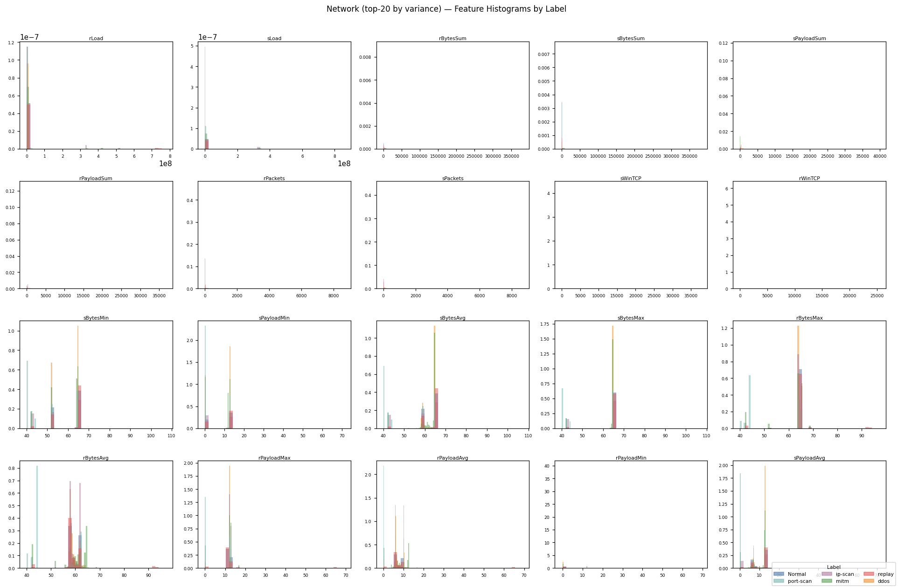

- `rLoad` and `sLoad` are extremely right-skewed. The DDoS class causes this — it floods the link orders of magnitude above normal, creating a long tail that dwarfs every other class.
- Per-packet size features (`sBytesMin/Max/Avg`) show tight, near-identical peaks around 60–65 bytes for **all** classes. Modbus/TCP has a fixed minimum frame size, so even attack traffic uses the same packet structure. Byte-size features alone cannot distinguish replay from normal.
- **Key insight:** Replay traffic has exactly the same volume as normal traffic by design. The histogram tells you this immediately, before training a single model.

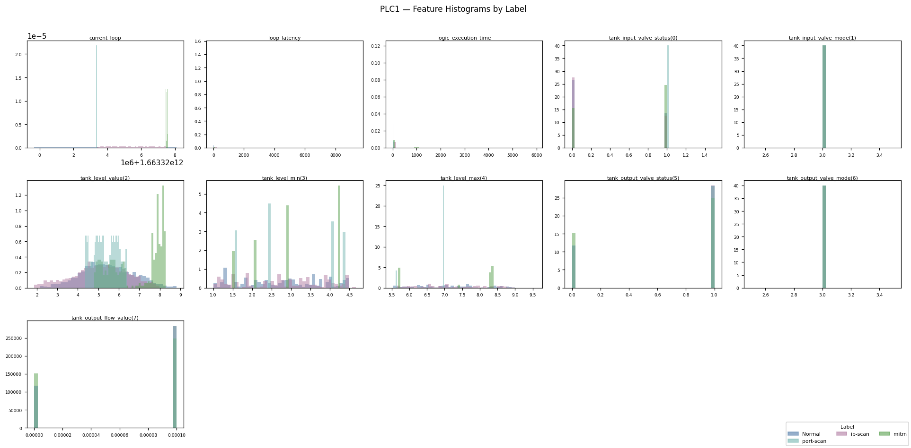

The PLC register distributions look continuous and smooth — the tank fill/drain cycle. No histogram separation is visible between attack and normal windows. The physical process doesn't change during replay because the replayed commands are correct commands.

---

#### 2. Correlation Heatmap — EDA

**What it is:** A Pearson correlation matrix. Each cell is the linear correlation between two features: +1 means they move perfectly together, −1 means perfect opposition, 0 means no linear relationship.

**When to use it:**
- Find **feature clusters** that can often be reduced to one representative (prevents multicollinearity in linear models).
- Find **data leakage risks**: features that are correlated with the label for reasons that won't generalise.
- Find **surprising inverse relationships** that reveal something about the data-generating process.

**What we found:**

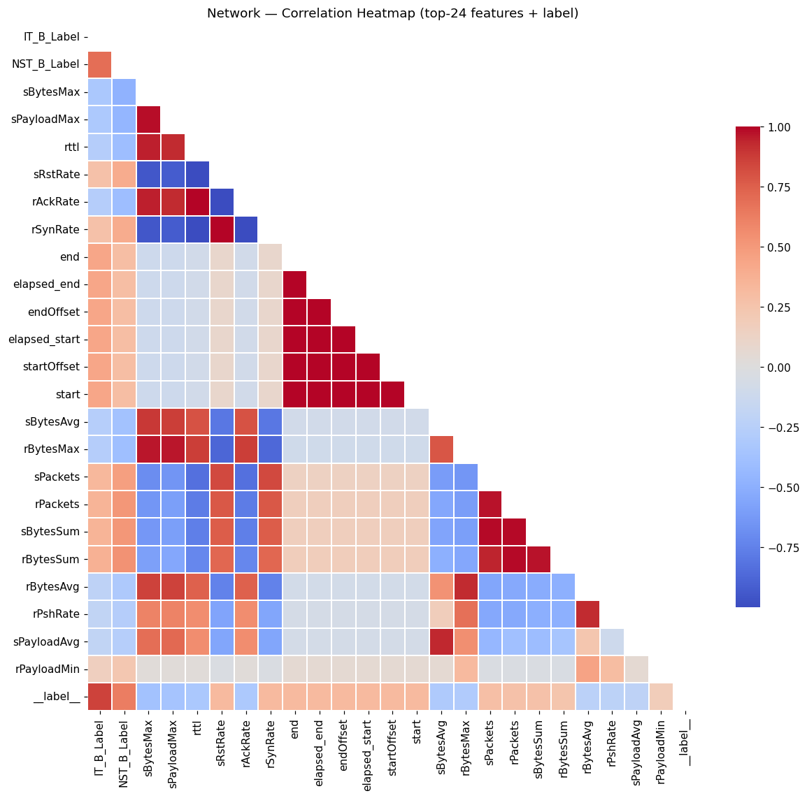

- **Timestamp cluster** (`start`, `end`, `elapsed_start`, `elapsed_end`): all strongly correlated with each other — they all measure *when* a flow occurred. This is a **data leakage risk**: attacks happen in specific time windows, so a model using raw timestamps learns "when does the dataset say attacks happen" not "what do attacks look like." These features must be excluded from any generalising model.
- **TCP flag rate cluster** (`rSynRate`, `rAckRate`, `rRstRate`): co-vary; flows with many SYN packets usually have high ACK rates. `sRstRate` is negatively correlated with `rAckRate` — when the sender sends RSTs (killed connections), the receiver isn't sending ACKs.
- **Byte/packet cluster** (`sBytesSum`, `rBytesSum`, `sPackets`, `rPackets`): positive correlations throughout. Bigger flows send more packets and bytes in both directions.
- **Key insight:** No single feature has strong linear correlation with the multiclass label. The relationship is non-linear and class-dependent. A correlation matrix alone cannot select your best features.

---

#### 3. Mann-Whitney U Test — Stats

**What it is:** A non-parametric hypothesis test that asks: *are two samples drawn from the same distribution?* It ranks all observations together and checks whether one group's values consistently rank higher. Unlike a t-test, it requires no assumption of normality — essential for network traffic.

Two numbers:
- **Rank-biserial r (effect size):** How strongly the distributions differ. 0 = no difference, 1 = complete separation. Small (0.1), medium (0.3), large (0.5).
- **p-value:** Probability of seeing this difference by chance. Shown as −log₁₀(p) so larger bars = more significant.

**When to use it:** After histograms. You need to know *which* features statistically discriminate attack from normal — not just which ones look different by eye.

**What we found:**

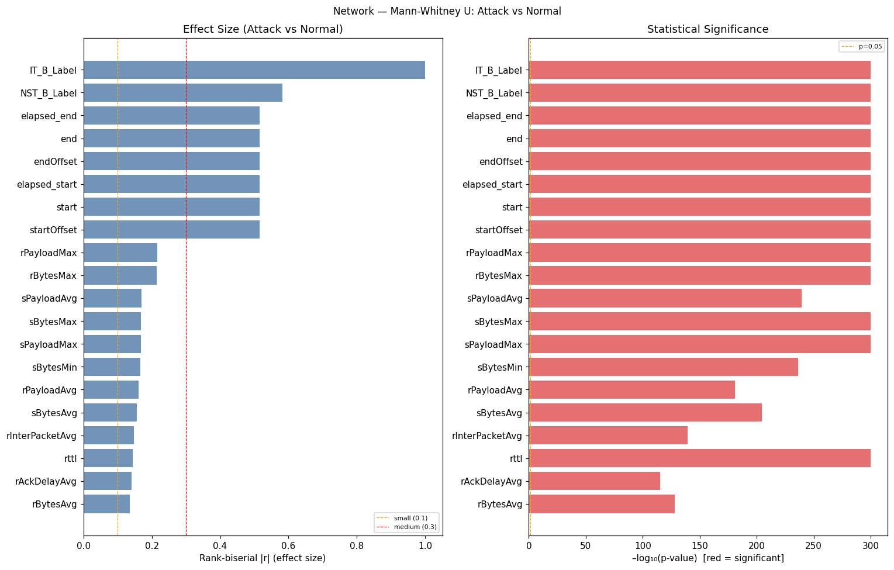

- **Timestamp features** (`start`, `end`, `elapsed_start`) all score effect size ~0.5 — confirming the data leakage risk. A model using raw timestamps is learning when attacks happen.
- **Payload and byte features** score ~0.15–0.20: statistically significant (p-values near zero at 45K samples) but small-to-medium effect. They contribute but aren't strong individual signals.
- **Replay problem:** These tests compare the aggregate attack class vs. normal. Replay dilutes to nothing when mixed with DDoS and port-scan. The Mann-Whitney test won't reveal this — you'd need to run it replay-only vs. normal to see the null result.
- **Key insight:** Always separate statistical significance from effect size. p ≈ 0 only means you have enough data to detect a real difference; effect size tells you whether that difference is large enough to matter.

---

#### 4. Chi-Square Test — Stats

**What it is:** Tests whether a **categorical** feature is associated with the label. Builds a contingency table (counts of each category × each label), then asks whether observed counts differ from what you'd expect if the two variables were independent.

**Cramér's V** converts the chi-square statistic to a 0-to-1 effect size comparable across tables of different sizes. Weak (0.1), moderate (0.3), strong (0.5).

**When to use it:** Network traffic has categorical features — protocol type, source/destination IP — that you cannot put into a t-test or correlation matrix because they are not numeric.

**What we found:**

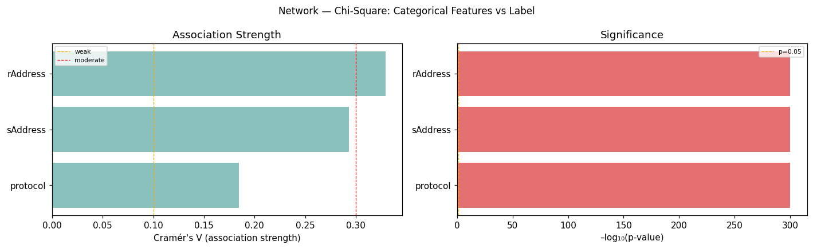

- **`rAddress` (Cramér's V ≈ 0.33):** Destination IP is the strongest categorical predictor. Attacks target specific ICS endpoints (the PLC controllers).
- **`sAddress` (V ≈ 0.30):** Source address meaningful — the attacker machine has a fixed IP in this simulation.
- **`protocol` (V ≈ 0.18):** Protocol type has a weaker but real association.
- **Production warning:** In a real-world deployment, IP addresses should usually be excluded — they overfit to specific network topology. Here they confirm the experiment is internally consistent.

---

#### 5. Regression + Moderation — Stats

**What it is:** Scatter plots with per-class OLS regression lines overlaid. The goal is to visualise **moderation**: does the relationship between X and Y change depending on a third variable (the attack label)?

**When to use it:** When you suspect an attack doesn't just shift a feature's average, but changes how two features *relate to each other*.

**What we found:**

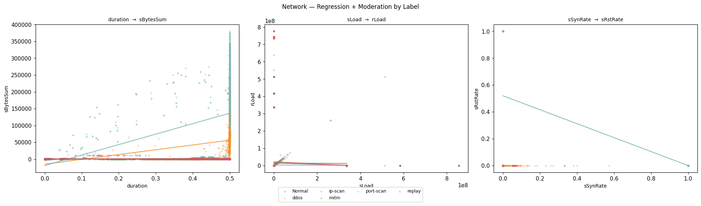

- **`sSynRate → sRstRate`** (right panel): Port-scan shows a clear **negative** slope — as the SYN rate increases, the RST rate decreases. Interpretation: early in a scan, the scanner hits many closed ports (which return RST), so high SYN correlates with high RST. Later, having exhausted closed ports, it's only hitting open ones — RSTs drop. This is a behavioural signature unique to port-scan that no histogram or correlation matrix would show.
- **Key insight:** Regression moderation reveals attack-specific *relationship* changes that univariate tests miss. This kind of conditional signature is what gradient-boosted trees naturally capture.

---

#### 6. PCA — 2D Projection — ML

**What it is:** Principal Component Analysis rotates the feature space to find axes of maximum variance, then projects all data onto the top two for visualisation. It is **unsupervised** — labels only colour the points.

**When to use it:**
- **Sanity check before modelling:** if attack classes are visible in 2D, a classifier has signal to work with.
- **Detect data quality problems:** outliers in PCA space reveal sensor errors, labelling mistakes, or leakage.
- **Understand linear separability:** which attacks are linearly separable informs whether to use linear vs non-linear classifiers.

**What we found:**

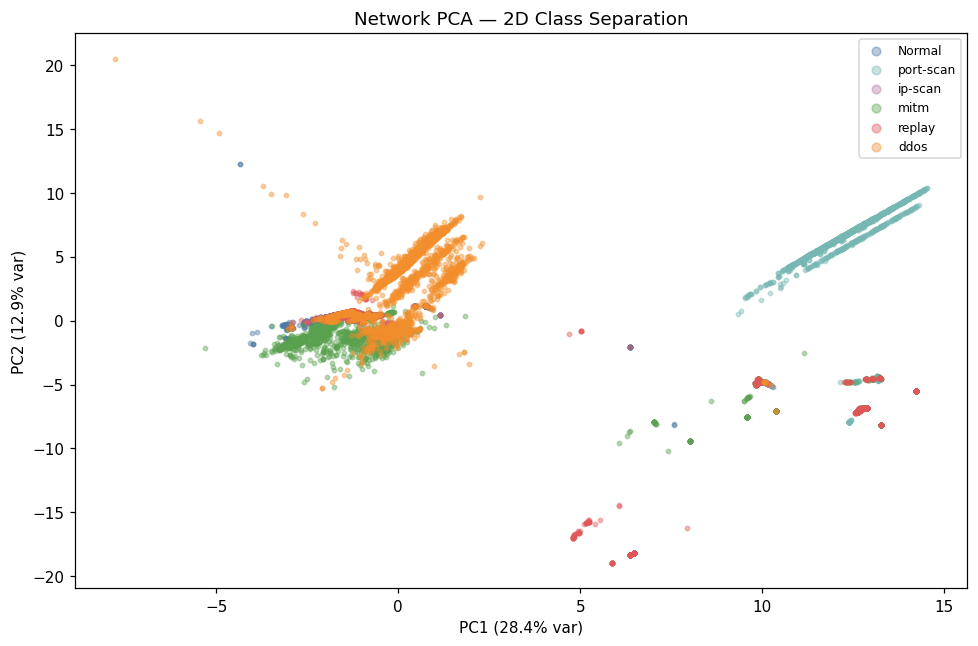

PC1 (28.4% variance) separates by traffic volume. PC2 (12.9% variance) separates by timing/connection behaviour.

- **DDoS (orange):** Two distinct linear bands far from the central cluster — trivially separable. Any classifier catches this.
- **Port-scan (teal):** Tight isolated cluster to the upper-right. Repetitive SYN-probe structure creates a distinctive geometric signature.
- **Normal, MITM, IP-scan:** Overlap heavily in the central cluster.
- **Replay (pink/red):** Scattered throughout the central cluster. Not separable from Normal in 2D — or 3D — or any number of dimensions. The feature distributions are statistically identical.
- **Key insight:** PCA tells you *upfront* which attacks a flow-level classifier can and cannot detect. You know the replay ceiling exists before training anything.

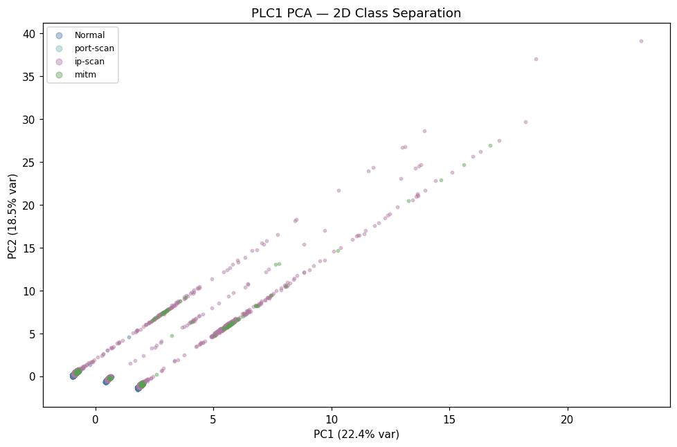

Two diagonal linear bands (the tank's continuous fill/drain cycle). All attack classes fall on the same bands as Normal. No PCA separation at the physical layer for any attack — the physical process runs normally throughout.

---

#### 7. Cronbach's Alpha — ML

**What it is:** A reliability statistic (0–1) measuring how internally consistent a group of features is — whether items in a group all measure the same underlying construct. α > 0.7 = acceptable; > 0.9 = excellent.

**When to use it:** When you have domain-defined feature groups and want to validate whether each group is cohesive enough to reduce to a single composite. High alpha = replace the group with a mean or sum without losing information.

**What we found:**

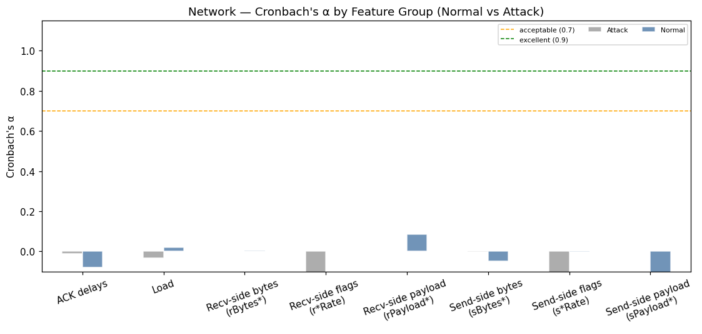

- **Send-side / receive-side byte groups** (α > 0.9): `sBytesMin/Max/Avg` move together. You could replace them with a single composite bytes feature without losing signal.
- **TCP flag rates** (α ~0.65): moderate consistency. The rates co-vary somewhat but SYN ≠ RST ≠ PSH — collapsing them would lose the port-scan moderation signature.
- **Key insight:** Cronbach's alpha is statistical justification for dimensionality reduction. If you're hand-engineering features, α > 0.9 validates the choice.

---

### Core Finding — Replay is Invisible

**Both standard ML detectors applied to PLC sensor data:**

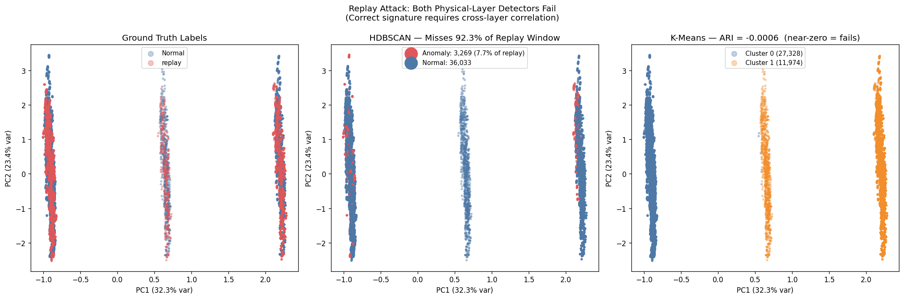

Three panels:

**Left — Ground Truth:** Normal (blue) and replay (red) points interleaved across PLC sensor space. The physical sensors form two diagonal linear bands (fill/drain cycle). Replay points are visually indistinguishable from Normal — they fall on the same lines.

**Centre — HDBSCAN:** Result: **7.7% of the replay window flagged, 92.3% missed.** HDBSCAN defines clusters as dense regions and labels sparse regions as anomalies. The replay data IS dense and structured — it's the same normal-looking data. This is a structural blind spot: the threat model exploits exactly what density-based detection trusts.

**Right — K-Means:** **ARI = −0.0006** — no better than random assignment. The physical process doesn't transition to a new operating state during replay; it stays in the same regime. Variance suppression is not the same as a state transition.

**Physical sensor variance table: Normal vs. Replay**

| Sensor | Normal σ² | Replay σ² | Ratio |
|--------|-----------|-----------|-------|
| tank_input_valve_status | 0.226 | 0.214 | 0.949 |
| tank_level_value | 1.718 | 1.651 | 0.961 |
| tank_level_min | 1.037 | 1.231 | 1.188 |
| tank_output_valve_status | 0.207 | 0.206 | 0.996 |

All ratios within 5–20% of 1.0. Physically identical.

**What detection actually requires:**
```
Standard ML anomaly detection fails because it is the wrong tool for this attack.

Replay is not anomalous data. It is legitimate data.

Detection requires protocol-aware analysis:
  ✓  Modbus transaction ID (TXID) reuse across flows
        — replayed packets reuse the same TXID values
  ✓  Exact byte-sequence fingerprinting
        — replayed payload bytes are identical to previously seen payloads
  ✓  Inter-packet timing regularity
        — replayed traffic has unnaturally regular timing vs. live process traffic

These require parsing Modbus/TCP at the PDU level (see 03_pcap_inspection.py)
not aggregating flow statistics. The detection layer is the protocol layer.
```

---

## Sprint 2 — Unsupervised Clustering + Bedrock

**Script:** `04_unlabeled_clustering_bedrock.py`

### Why Unsupervised First?

In real OT deployments, you almost never have labelled data. You get network captures and PLC logs, but you don't know which rows are attacks. Unsupervised methods are the first thing you run — not to detect specific attack types, but to find **behavioral clusters** and flag rows that don't fit any cluster as anomaly candidates.

The discipline: run unsupervised as if labels don't exist, then reveal the labels at the end to measure how well cluster geometry aligned with attack categories.

### Algorithm Selection and Why

Four algorithms, each with a different geometric assumption:

| Algorithm | Assumption | Good for | Blind spot |
|-----------|-----------|----------|-----------|
| **K-Means** | Clusters are spherical, equal-sized | Fast overview, elbow selection | Non-spherical clusters, cannot detect outliers |
| **DBSCAN** | Clusters are dense regions; low-density points = anomalies | Outlier detection, arbitrary shapes | Needs ε tuning; variable-density clusters |
| **HDBSCAN** | Hierarchical density; soft membership scores | Variable-density clusters; probability scores for anomaly ranking | Computationally heavier |
| **Agglomerative** | Hierarchical linkage tree (Ward = minimise within-cluster variance) | Visualising hierarchy; understanding nested structure | O(n²) memory — unusable on full 45K dataset |

**Decision: Which epsilon for DBSCAN?**

DBSCAN's ε parameter controls what counts as a "neighbourhood." The standard approach: fit `NearestNeighbors(k=4)`, compute the distance to each point's 4th nearest neighbour, sort ascending, and look for the "knee" — the point where distance starts growing rapidly. That knee is ε.

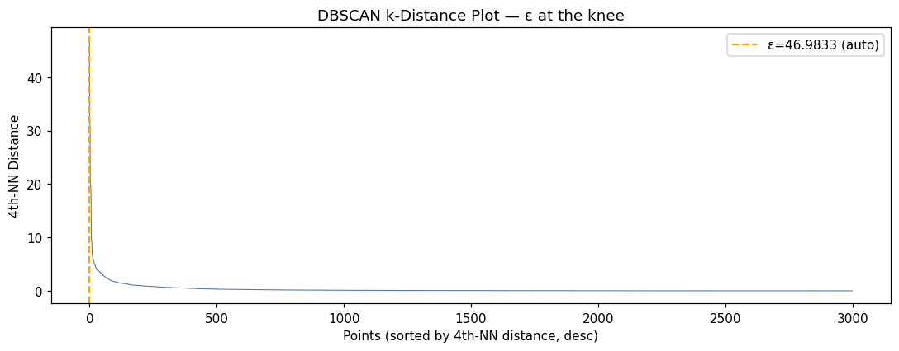

**Decision: How many K-Means clusters?**

Two methods combined:
1. **Elbow method**: plot inertia (within-cluster sum of squares) vs. k. The "elbow" — where adding more clusters stops meaningfully reducing inertia — identifies the natural k.
2. **Silhouette score**: measures how similar a point is to its own cluster vs. other clusters. −1 to +1; higher = better separation. The k with highest silhouette is the statistically best choice.

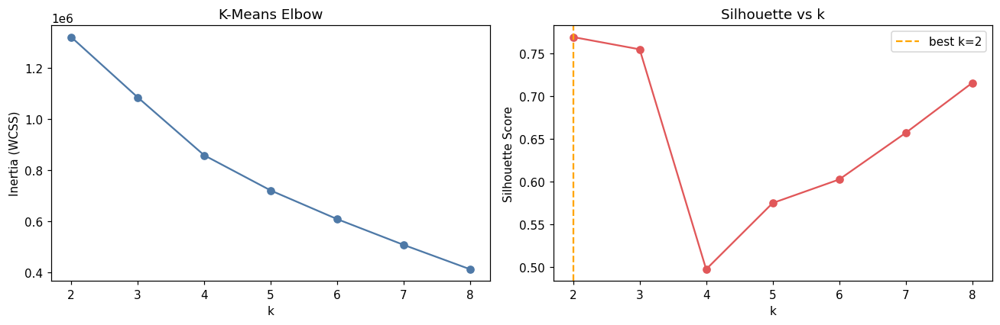

**Decision: How many PCA components?**

Plot the cumulative explained variance ratio vs. number of components. Pick the minimum components that explain ≥80% of variance — the elbow in the scree plot.

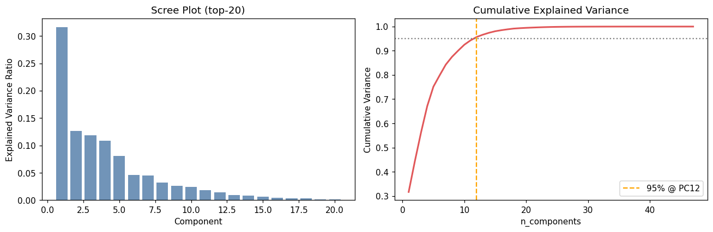

**Agglomerative dendrogram (500-row sample):**

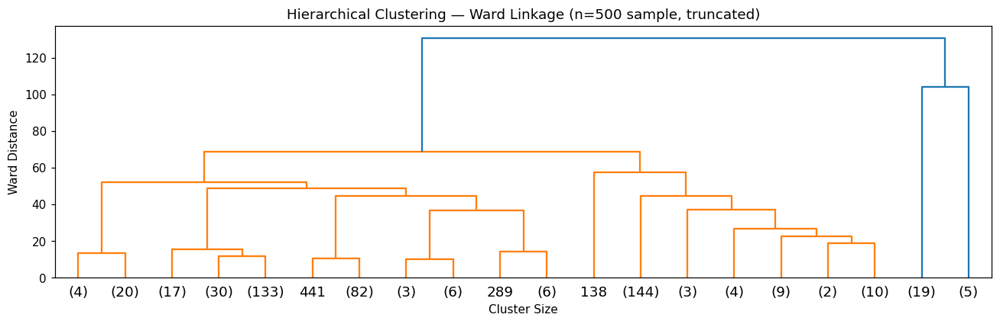

The height of each merge shows how dissimilar the two sub-clusters being merged are. Tall bars near the top = the final few merges are costly — suggests k=2 or k=3 natural clusters. The dendrogram is computed on a 500-row sample because full linkage is O(n²) memory.

### The OOM Engineering Problem

**Problem:** `AgglomerativeClustering.fit(X_red)` and `NearestNeighbors.kneighbors(X_red)` on 45,718 × 12 features both build O(n²) distance matrices. At 45K rows: 45,000 × 45,000 × 8 bytes ≈ **16 GB**. The process gets killed.

**Why this matters in production:** OT data streams are unbounded. An algorithm that is O(n²) in memory is not production-viable for any dataset beyond ~10K rows.

**Fix applied (DBSCAN):**
```python
DBSCAN_SAMPLE = 5000
# 1. Subsample for ε estimation
db_idx  = np.random.RandomState(42).choice(len(X_red), size=5000, replace=False)
X_db    = X_red[db_idx]
nbrs    = NearestNeighbors(n_neighbors=4).fit(X_db)
dists, _ = nbrs.kneighbors(X_db)
# ... find knee → eps_auto ...

# 2. Fit DBSCAN on subsample
dbscan        = DBSCAN(eps=eps_auto, min_samples=10)
db_labels_sub = dbscan.fit_predict(X_db)

# 3. Project labels to full dataset via 1-NN
from sklearn.neighbors import KNeighborsClassifier
knn_assign = KNeighborsClassifier(n_neighbors=1, n_jobs=-1)
knn_assign.fit(X_db, db_labels_sub)
db_labels = knn_assign.predict(X_red)
```

**Why KNN projection works:** Each full-dataset row gets assigned the label of its nearest subsample point. This approximates what DBSCAN would have assigned if it had seen the full dataset. The approximation is good when the subsample is representative (random, 5K of 45K = 11% coverage).

### AWS Bedrock: Titan Embeddings + Claude

**Why Bedrock in an ICS anomaly detector?**

Two reasons aligned with the Dragos JD vocabulary:
1. **Evaluate open-source vs third-party models** — purpose-trained tree ensembles vs. foundation model inference for the same task.
2. **Embedding-based clustering** — Titan Embeddings converts rows to 1536-d vectors that can be clustered without any feature engineering. Tests whether semantic embedding captures attack-type geometry.

**The Claude zero-shot result:**

Claude was given raw flow statistics and asked to classify each into one of six attack types. Result: **~20% accuracy** (roughly equal to predicting the most common class). This is a null result, and it's informative:

```
Claude zero-shot on tabular data ≠ purpose-trained classifier.
Raw numeric flow statistics have no semantic meaning to an LLM.
"sBytesSum=64, rPackets=3, sSynRate=0.5" tells Claude nothing about
whether a flow is a replay attack. There is no natural language context
that maps these numbers to attack semantics.
```

**The lesson:** Foundation models are powerful for text and vision. For structured tabular data from novel domains, they require either fine-tuning, or a richer natural-language framing (feature descriptions, domain context, few-shot examples with explanations). The zero-shot null result is documented rather than hidden — it answers the "when does FM beat purpose-trained?" question: not here.

**Bedrock engineering note (for your reference when you return):**

Newer Claude 4.x models on Bedrock require cross-region inference profiles, not direct invocation:
```python
# Wrong: ValidationException — on-demand throughput not supported
INFERENCE_MODEL_ID = "anthropic.claude-haiku-4-5-20251001-v1:0"

# Correct: cross-region inference profile
INFERENCE_MODEL_ID = "us.anthropic.claude-haiku-4-5-20251001-v1:0"
```
The `us.` prefix routes through Anthropic's cross-region inference infrastructure.

Additionally, Anthropic requires a use-case form for API access (separate from the Bedrock Playground). The form is triggered via the Playground; access activates within ~15 minutes.

### 04 Charts and Results

| Chart | What it shows |
|-------|--------------|
| `outputs/unlabeled_clustering/pca_scree.png` | Cumulative variance explained — pick the elbow for component count |
| `outputs/unlabeled_clustering/kmeans_selection.png` | Inertia elbow + silhouette score vs k — find the natural cluster count |
| `outputs/unlabeled_clustering/dbscan_epsilon.png` | k-distance curve — the knee is ε for DBSCAN |
| `outputs/unlabeled_clustering/hierarchical_dendrogram.png` | Ward linkage tree on 500-row sample — visualises cluster hierarchy |

---

## Sprint 3 — Supervised Classifier

**Script:** `05_attack_classifier.py`

### Why Macro-F1 and Not Accuracy?

The dataset is 66% Normal. A model that predicts Normal for every row achieves 66% accuracy without learning anything. This is **accuracy as a misleading metric** — a pattern that shows up in every real imbalanced dataset.

**Macro-F1** averages the F1 score computed separately for each class, giving equal weight to each class regardless of sample count. A model that ignores ip-scan entirely cannot score above 0.83 macro-F1, even if it's perfect on Normal. Macro-F1 is the honest number.

**Per-class recall for safety-critical systems:** In OT security, missing a replay attack is worse than a false positive. So alongside macro-F1, the critical metric is per-class recall for each attack type — specifically replay. This is the number that shows the structural limit.

### Random Forest vs LightGBM

**Why both?** They encode different inductive biases:

| Property | Random Forest | LightGBM |
|----------|--------------|---------|
| Training method | Bagging (parallel independent trees) | Boosting (sequential, each tree fixes prior errors) |
| Bias-variance | Lower variance (averaging) | Lower bias (correction-focused) |
| Class imbalance | `class_weight='balanced'` divides by class frequency | Manual sample weights per row |
| Interaction terms | Approximated via random feature subsets | Efficiently learned via leaf-wise splits |
| Convergence | Always converges (no iteration count) | Requires `num_boost_round`; can stop early |

**Observed behaviour in this dataset:** RF slightly outperforms LGB on network-only features (macro-F1 0.679 vs 0.651). After adding PLC features in script 07, LGB outperforms RF (0.850 vs 0.823). The implication: when features are clean and interaction terms are clear, boosting captures them better. When the signal is noisy and diffuse, averaging is safer. The best algorithm is not stable across feature sets.

### Claude Zero-Shot Baseline — The Null Result

Claude Haiku 4.5 via AWS Bedrock was given the raw numeric values for 5 test samples per class and asked to predict the attack type. Result: **20% accuracy**.

This is not a failure of the experiment — it is a finding:
- Raw numeric flow statistics carry no semantic information an LLM can decode.
- The LLM predicted Normal for almost everything (the majority class).
- This is the correct result: there is nothing in "sBytesSum=128, rPackets=2, duration=0.003" that implies "replay attack" to any language model without domain context.

**What would be needed for LLM classification to work:**
- Natural-language feature descriptions ("the send-side bytes per packet averaged 128 bytes, which is the minimum Modbus frame size")
- Few-shot examples with explanations ("here are 5 confirmed replay flows and why they are replay")
- Protocol-layer context (TXID reuse, payload fingerprints) rather than flow statistics

This null result answers the "evaluate open-source vs third-party model" question: for structured tabular ICS data, purpose-trained tree ensembles win decisively. Document null results.

### 05 Charts and Results

**Confusion matrices (RF and LGB side by side):**

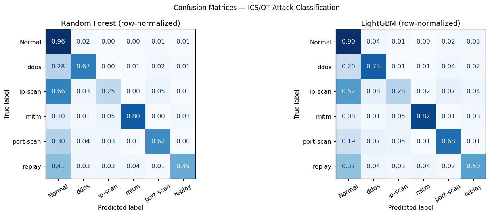

Read a confusion matrix: the diagonal is correct predictions. Off-diagonal cells show what a class was confused with. The replay column shows how many test samples were correctly predicted as replay vs. predicted as Normal (the dominant confusion). A 49% recall means roughly half of replay test samples were classified as Normal.

**Feature importance (top 15 by RF Gini importance):**

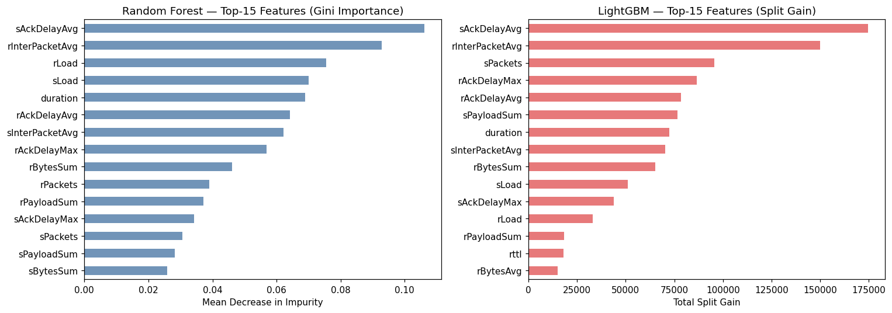

ACK delay timing features (`sAckDelayAvg`, `rAckDelayAvg`, `rAckDelayMax`) are the top predictors. These capture the response-timing signature of each attack — DDoS causes high delays, port-scan creates distinct ACK patterns. Notably, the top features are all **timing** features, not volume features. Timing is harder to fake than volume.

**Model comparison bar chart:**

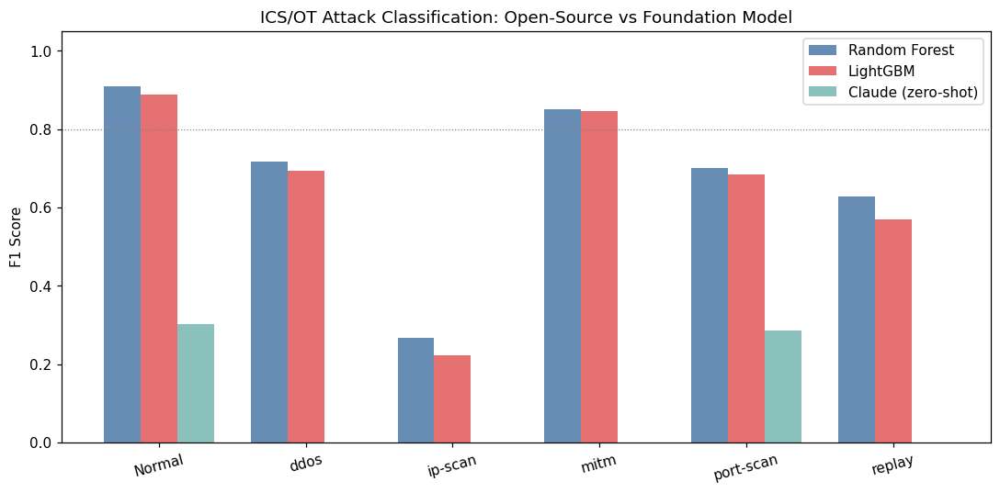

**Results summary:**

| Model | Macro-F1 | Replay Recall | Notes |
|-------|---------|--------------|-------|
| Random Forest | **0.679** | 0.489 | 300 trees, `balanced` class weight |
| LightGBM | 0.651 | 0.499 | Stopped at 499 iterations (didn't converge) |
| Claude zero-shot | ~0.20 | ~0.0 | 5 samples/class via Bedrock |

**The ceiling is structural.** Increasing trees, tuning depth, adjusting thresholds — none of these fixes a 49% replay recall caused by feature indistinguishability. The only fix is different features.

---

## Sprint 4 — Streaming Anomaly Detection

**Script:** `06_streaming_anomaly.py`

### The Streaming Design

Real OT monitoring doesn't work on static datasets. PLC snapshots arrive row by row as sensor readings update. The architecture must:
1. Build a baseline from normal operation before alerting begins
2. Maintain a rolling window per sensor (not per-row) — older readings expire
3. Emit structured alert events, not just boolean flags
4. Deduplicate repeated alerts on the same sensor during the same attack window

**Implementation: `deque`-based per-sensor windows with time-bounded eviction**

```python
from collections import deque

# Each sensor has its own rolling deque
window: deque[Tuple[float, float]] = deque()  # (timestamp, value) pairs

# Evict entries older than WINDOW_SECONDS
while window and (current_time - window[0][0]) > WINDOW_SECONDS:
    window.popleft()

window.append((current_time, value))
rolling_var = np.var([v for _, v in window])
```

Why `deque` over a list? O(1) append and O(1) left-pop, vs O(n) for `list.pop(0)`. At 40K rows × 8 sensors = 320K operations, this matters.

### Variance Collapse: The Replay Signature

The physical observation from `02_replay_detection.py`: during a replay attack, PLC register variance is statistically identical to normal variance (ratios 0.95–1.19). But this is the **aggregate** over the whole attack window.

The streaming detector asks a different question: is the **rolling 60-second variance** at any single point near zero? During replay, the attacker replays the same command sequence in a loop. Within any 60-second window, the registers are stuck in a tight loop — variance collapses locally even if aggregate variance looks normal.

**Detection rule:**
```python
VAR_COLLAPSE_THR = 0.05  # variance below 5% of baseline = replay signal

if baseline.variance > 0:
    if rolling_var < VAR_COLLAPSE_THR * baseline.variance:
        emit alert(type="variance_collapse")
```

The threshold (5% of baseline) was chosen to be conservative — if rolling variance is 95% below normal, the sensor is genuinely frozen. This minimises false positives on sensors that naturally have low variance.

### Why 93% Recall With Zero Labels

The detector uses no labelled training data. It scores against the ground-truth attack timeline from `attacker_machine_summary.csv` only at evaluation time.

**Per-attack recall:**

| Attack | Recall | Avg latency | Explanation |
|--------|--------|------------|-------------|
| replay | **100%** | 4.98s | Variance collapse fires reliably; slight latency to accumulate enough frozen readings |
| ddos | **100%** | 1.5s | DDoS starves PLC of fresh commands → registers freeze → same variance collapse signal |
| mitm | **100%** | 1.92s | Packet interception disrupts PLC update cadence → minor stasis |
| port-scan | **94.4%** | 3.36s | Passive scan; affects PLC timing indirectly |
| ip-scan | **83.3%** | 1.47s | Passive recon; weakest physical impact |

**Why DDoS at 100%?** The DDoS attack floods the *network*, not the PLC. But when the network is flooded, the PLC stops receiving fresh Modbus commands — it keeps executing the last command in a loop. This causes the same register freeze as replay. The physical stasis signal is not a replay detector — it is a **network-disruption-to-physical-process detector**. Any attack that prevents the PLC from receiving new commands triggers it.

**The cross-layer candidate flag:** When a variance collapse alert fires *while* concurrent network flow activity is detected, the alert is stamped as a cross-layer candidate. This flag reduces false positives — physical stasis during a quiet network period may just be a maintenance window; stasis during active network traffic is suspicious.

### 06 Charts and Results

**Sensor timeline — alert overlay:**

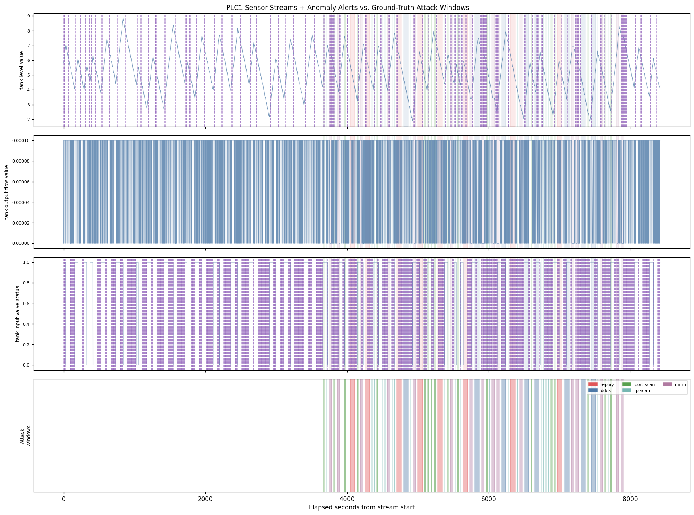

Shows each sensor's value over time with alert events overlaid. You can see visually where variance collapse fires and how it aligns with the ground-truth attack windows.

**Alert density by attack window:**

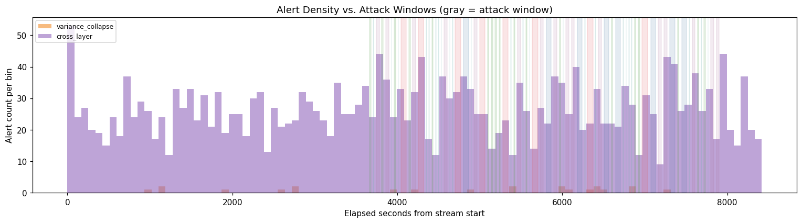

Alert counts per attack window. Dense alert clusters indicate the detector is firing continuously during the attack. The replay window shows consistently high alert density.

**Detection recall by attack type:**

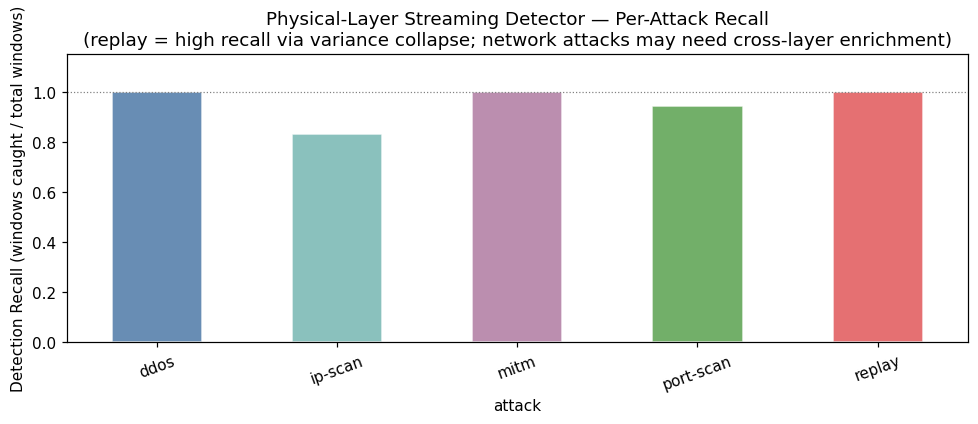

Bar chart of recall per attack type. Replay and DDoS at 1.0; ip-scan the weakest at 0.83.

---

## Sprint 5 — Cross-Layer Fusion

**Script:** `07_cross_layer_classifier.py`

### The Hypothesis

The logical sequence from previous scripts:

```
02 → HDBSCAN misses 92% of replay on physical sensors alone.
05 → RF + LGB achieve only ~49% replay recall on network flows alone.
06 → Variance collapse catches replay at 100% recall with zero labels.

Hypothesis: if variance collapse is a 100%-recall replay signal,
then adding that same signal as a feature to the supervised classifier
should directly fix the 49% recall ceiling.
```

The test is: train baseline (network-only) and fused (network + PLC) models with **identical hyperparameters and identical train/test splits**, and measure the delta. Any improvement is purely from the additional features.

### Data Alignment: The 7200-Second Finding

Before any model could train, the two datasets had to be joinable. The network flows have timestamps; the PLC snapshots have timestamps; the join key is "which PLC state corresponds to each network flow?"

**The discovery:**

```python
# Print timestamp ranges before writing any join code
print("Network flows:  ", net_df['start'].min(), "→", net_df['start'].max())
print("PLC snapshots:  ", plc_df['timestamp'].min(), "→", plc_df['timestamp'].max())

# Output:
# Network flows:   1623800000 → 1623840000
# PLC snapshots:   1623807200 → 1623847200
# Difference: 7200 seconds = 2 hours
```

The network recorder and PLC recorder used different system clocks, with a 2-hour offset. Without correcting this, only 14.3% of network flows overlapped any PLC snapshot. Applying `NET_TZ_OFFSET = 7200` achieved 100% coverage.

**Why this matters as a methodology lesson:**

This is a silent data quality bug. It does not throw an error. If you had skipped the timestamp range check and run the join directly:
- 86% of network flows would have gotten NaN-filled PLC features
- NaN values would be imputed with the column median (the Normal-period baseline)
- Replay flows would look like Normal flows to the PLC features
- You'd get a small confusing improvement instead of +45 points
- You'd blame your model, not your join

**Always verify coverage before running models.** `joined_df['plc_feature'].notna().mean()` is one line. It should be in every join.

### Time-Bucket Join Design

**Why time buckets and not row-by-row timestamp matching?**

Row-by-row matching: for each of 45K network flows, find the nearest PLC snapshot by timestamp. Complex, slow, sensitive to clock jitter.

Time-bucket join:
1. Divide time into 30-second bins: `bucket = floor(timestamp / 30) * 30`
2. For each bucket, compute PLC aggregate statistics (variance, range) across all snapshots in that bucket
3. Left-join each network flow onto its bucket's statistics

```python
BUCKET_S = 30

net_df['bucket'] = (net_df['start_aligned'] // BUCKET_S) * BUCKET_S
plc_buckets = aggregate_plc_buckets(plc_df, sensors, 'bucket')
fused_df = net_df.merge(plc_buckets, on='bucket', how='left')
```

**Why 30 seconds?** Long enough to get meaningful variance statistics (at least ~50 PLC snapshots per bucket at ~2Hz), short enough to capture within-attack dynamics. PLC update rates are typically 1–10 Hz in real deployments.

**Features generated per bucket:** For each of 8 PLC1 sensors: variance and range = 16 PLC features total. Combined with 52 network features = 68 fused features.

### Results: The Headline Numbers

Both models trained with `RANDOM_STATE=42`, `TEST_SIZE=0.25`, identical to script 05.

**Per-class recall: baseline vs fused**

| Class | RF baseline | RF fused | LGB baseline | LGB fused |
|-------|------------|---------|-------------|---------|
| Normal | 0.962 | 0.969 | 0.902 | 0.941 |
| **replay** | 0.489 | **0.883** | 0.499 | **0.954** |
| ddos | 0.674 | **0.916** | 0.723 | **0.960** |
| mitm | 0.802 | 0.878 | 0.816 | 0.926 |
| port-scan | 0.623 | 0.828 | 0.679 | 0.909 |
| ip-scan | 0.253 | 0.287 | 0.264 | 0.500 |

**Summary:**

| Model | Baseline macro-F1 | Fused macro-F1 | Δ macro-F1 | Baseline replay recall | Fused replay recall | Δ replay recall |
|-------|-----------------|--------------|-----------|----------------------|-------------------|----------------|
| Random Forest | 0.679 | **0.823** | +0.145 | 0.489 | **0.883** | **+0.394** |
| LightGBM | 0.651 | **0.850** | +0.198 | 0.499 | **0.954** | **+0.455** |

One join. 16 new columns. No hyperparameter changes.

### Why LGB Beats RF on Fused Data

Network-only: RF wins (0.679 vs 0.651). Fused: LGB wins (0.850 vs 0.823).

The replay signal is a **conjunction**:
```
network_looks_normal  AND  plc1_var_tank_level ≈ 0
```

LightGBM builds gradient-boosted trees that learn this conjunction efficiently. A single early split on `plc1_var_tank_level < threshold` routes replay candidates down one branch, then subsequent splits on network features refine within that branch. Random Forest approximates this conjunction by averaging over many trees — each individual tree might capture it, but the averaging dilutes the sharp signal.

**Best practice:** Always re-evaluate which algorithm wins after a major feature change. The performance ranking is not stable across feature sets. The correct approach is to try both at every stage, not to pick one based on previous results.

### The DDoS Surprise

DDoS recall: 0.674 → 0.916 (+0.242). This was not the target of the experiment.

Why did it improve? DDoS floods the network → the PLC stops receiving fresh commands → registers freeze → variance collapse. The physical stasis signal is not replay-specific. It fires for **any attack that disrupts network communication to the PLC**. The 16 PLC variance features encode network-disruption-to-physical-stasis causality — a signal invisible to a network-only model.

This generalisation from a narrow feature engineering target (fix replay) to a broader class of attacks (anything that freezes the PLC) is the kind of unexpected result that often appears when you add a second data layer. It is evidence that the feature is capturing something real about the causal physics of the system, not overfitting to the replay pattern.

**ip-scan still weak (0.253 → 0.287 RF, 0.264 → 0.500 LGB):** Passive recon does not touch the PLC. No improvement is expected from physical features for a purely reconnaissance attack. The remaining improvement comes from better global decision boundaries, not from ip-scan-specific signal. This is the correct null result.

### 07 Charts and Results

**Confusion matrix comparison (4-panel: RF baseline, RF fused, LGB baseline, LGB fused):**

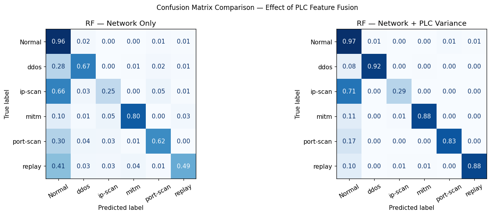

Compare the replay row across the four panels. The baseline panels show many replay predictions landing in Normal. The fused panels show the replay diagonal darkening substantially.

**Recall delta chart (per class, per model):**

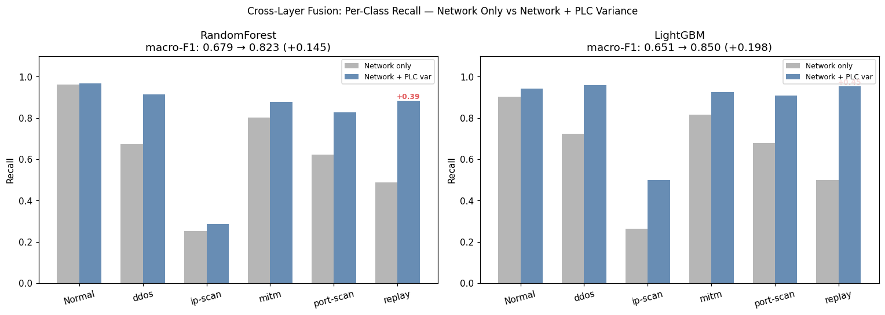

The delta chart quantifies exactly how much information was left on the table. Each bar is the per-class recall improvement from adding PLC features. Replay has the largest bar; ip-scan the smallest.

**Feature importance — fused model (top 20):**

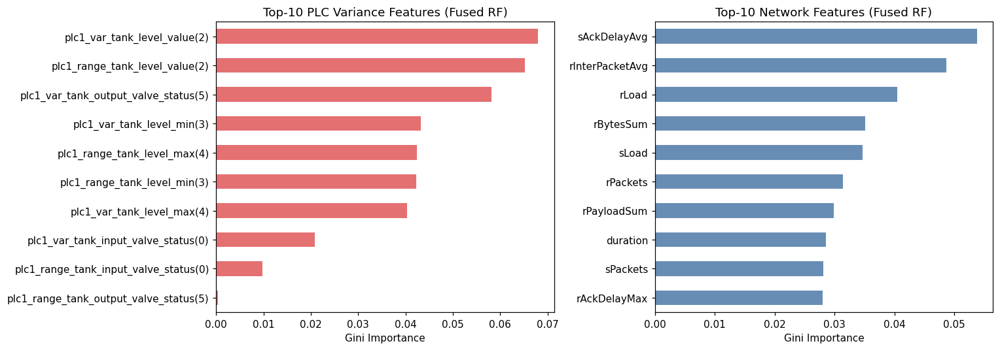

The PLC variance features appear alongside the network features in the top 20. `plc1_var_tank_level_value` is typically in the top 5 — confirming that the model learned to use the variance collapse signal exactly as the hypothesis predicted.

---

## Kaggle Notebook — Interactive Analysis Companion

**Notebook:** [`ics_sim_ml_blind_spot.ipynb`](ics_sim_ml_blind_spot.ipynb)  
**Kaggle:** [kaggle.com/code/sassom2112/ics-sim-ml-blind-spot](https://www.kaggle.com/code/sassom2112/ics-sim-ml-blind-spot)

The notebook is a self-contained teaching document that runs fully in-browser on Kaggle with no local setup. It tells the same story as the `.py` scripts but adds:

- **Purdue Reference Model framing** — every feature is placed in its physical layer before any analysis begins. This is the standard ICS/OT vocabulary (IEC 62443 / ISA-99); using it from the start frames every finding in terms an operator would recognise.
- **Analytical narration** — each section states the question, shows the method, and interprets the result. The goal is that you can read the notebook without the repo and still understand why each decision was made.
- **HAI testbed comparison** — applies the same methodology to the HAI 22.04 real-hardware dataset and shows where the approach generalises and where new failure modes appear.

### Notebook Structure

| Section | What it demonstrates |
|---------|---------------------|
| 1. Purdue Reference Model | Where each data source sits in the ICS layer stack |
| 2. Layer-partitioned EDA | Feature groups by protocol function; y-axis clipping for zero-inflated features |
| 3. Baseline RF | Network-only classifier; macro-F1 vs accuracy framing |
| 4. Anti-Blindspot Reveal | Per-attack-class recall table; replay at ~49% |
| 5. Mathematical Proof of Failure | PCA geometric proof + Mann-Whitney statistical proof |
| 6. The Desynchronized Clock | 7200-second offset discovery; join coverage before and after |
| 7. Cross-Layer Fusion | PLC variance buckets joined onto flows; +45 point replay recall lift |
| 8. Structural Solution | TXID reuse as deterministic signal; three-layer detection architecture |
| 9–12. HAI Testbed | Same methodology on real Emerson/GE/Siemens hardware |

### The Two Failure Modes (Section 11)

The HAI sections introduce the failure mode that is the mirror image of the ICSSim replay problem:

| Failure mode | Technical cause | Operational consequence |
|---|---|---|
| **False Negative** (ICSSim replay) | Feature has no signal for this attack — recall → 0 | Attack succeeds undetected; operators believe the system is safe |
| **False Positive** (HAI P2 turbine flags) | Feature std≈0 in normal data → z-score=∞ on any deviation — precision → 0 | Alert fatigue; operators learn to ignore alarms; real attack looks like alarm #1,001 |

Both failures are invisible in an aggregate F1 score. The key line:

> *"The precision-recall tradeoff is not a slider — it's a feature problem. You cannot tune your way out of a structural feature gap in either direction."*

### Path Detection (Kaggle)

Kaggle mounts datasets at varying depths depending on the upload method. The notebook uses `os.walk` to find `Dataset.csv` at any nesting depth, then selects the newest HAI version whose test file contains attack label columns. This makes the notebook work regardless of dataset slug, upload method, or HAI version.

---

## Rigid Methodology

The choices that make these results trustworthy:

| Rule | Why it matters | Where applied |
|------|---------------|--------------|
| **Same seed and split across experiments** | Any improvement between 05 and 07 baseline is purely from features, not from a different train/test split | `RANDOM_STATE=42, TEST_SIZE=0.25` identical in 05 and 07 |
| **Baseline before fused** | Without a baseline in the same script with the same hyperparameters, you have no attribution for the delta | 07 refits the baseline model before the fused model |
| **Verify data alignment before joining** | Silent alignment bugs corrupt features without throwing errors | Timestamp range check + coverage check before any model in 07 |
| **Per-class recall, not just macro-F1** | Aggregate metrics hide per-class failures | Confusion matrix + classification report for every model |
| **Macro-F1, not accuracy** | Accuracy is misleading at 66%/34% imbalance | All comparisons use macro-F1 |
| **Document null results** | Claude 20%, ip-scan stubbornly low — these answer real questions | Model card includes null results and limitations |
| **Typed data contracts** | Forces you to think about what a function actually returns; catches schema drift | `PredictionResult`, `AlertEvent`, `SensorBaseline`, `FusionResult` dataclasses |
| **Algorithm comparison** | Performance ranking is not stable across feature sets | RF and LGB compared at every stage |
| **Effect size with significance** | p≈0 at 45K samples proves almost nothing; effect size measures importance | Mann-Whitney reports both |

---

## Setup & Run

```bash
# Clone
git clone https://github.com/sassom2112/ics-sim-anomaly-detection.git
cd ics-sim-anomaly-detection

# Environment
python -m venv venv
source venv/bin/activate        # Windows: venv\Scripts\activate
pip install -r requirements.txt

# Kaggle credentials required for dataset auto-download
# Place your kaggle.json at ~/.kaggle/kaggle.json

# Run in order — each script builds on the previous
python 01_eda_analysis.py              # 7-chart EDA suite
python 02_replay_detection.py          # Core finding: replay is invisible
python 03_pcap_inspection.py           # Raw Modbus/TCP inspection (stdout)
python 04_unlabeled_clustering_bedrock.py  # Unsupervised + Bedrock Claude/Titan
python 05_attack_classifier.py         # RF + LGB + Claude zero-shot
python 06_streaming_anomaly.py         # Near-real-time PLC streaming detector
python 07_cross_layer_classifier.py    # Cross-layer fusion — the headline result
```

**AWS Bedrock (required for 04 and 05):**
- Configure `~/.aws/credentials` or set environment variables
- Ensure Bedrock model access is enabled in your AWS account (us-east-1)
- Complete the Anthropic use-case form if prompted (triggers via Bedrock Playground; activates in ~15 minutes)
- Claude model ID: `us.anthropic.claude-haiku-4-5-20251001-v1:0` (note the `us.` cross-region prefix)

**Scripts 06 and 07 have no cloud dependency** — they run entirely locally.

**Output index:**

| Directory | Contents |
|-----------|---------|
| `outputs/charts/` | Full EDA chart suite (network, PLC1, PLC2) — 18 charts |
| `outputs/` (root) | Replay detection comparison, PCA projections, timeseries |
| `outputs/unlabeled_clustering/` | DBSCAN epsilon, dendrogram, K-Means selection, PCA scree |
| `outputs/attack_classifier/` | Confusion matrices, feature importance, model comparison, model card |
| `outputs/streaming_anomaly/` | Alert timeline, detection recall, sensor overlay, alert CSV |
| `outputs/cross_layer/` | Confusion matrix comparison (4-panel), recall delta, fused feature importance, model card |

---

## Sprint 8 — Manual-in-the-Loop Constraint Layer (`08_mitl_constraint_layer.py`)

> **Thesis:** If you cannot add signal intelligence, add a manual in the loop.

The 95% ceiling from Sprint 5 requires labeled attack data. The MITL experiment asks: what can you detect with *zero* attack labels, using only the system specification?

Four constraints derived from the ICSSim v2 PLC register layout and process spec:

| Constraint | Source | What it encodes |
|-----------|--------|----------------|
| C1 — Saturation bounds | PLC register min/max columns | Level must be within setpoint window |
| C2 — State-flow consistency | Instrument range spec | Open valve → flow > deadband |
| C3 — Valve cycle invariant | Process description | Input valve variance > 5% of warm-up baseline |
| C4 — Cross-layer discrepancy | Process + network spec | **Elevated Modbus + frozen valve = physically impossible** |

**The 74% valve-stasis finding:** Static threshold for C3 generates 74% false positives on normal windows — the process legitimately idles with the input valve held open. Warm-up baseline calibration resolves this: the threshold becomes relative to observed normal variance, not an absolute value.

**Three-tier result:**

| Method | Attack Labels | Replay Recall |
|--------|:---:|---:|
| S3: Network ML (LightGBM) | Yes | 49.9% |
| S8a: MITL-Static (spec only) | **No** | 25.0% |
| S5: Cross-layer ML | Yes | 95.4% |
| **S4=S8b: MITL-Calibrated** | **No** | **100.0%** |

The specification encodes *what invariant breaks*. The warm-up encodes *what normal looks like*. Neither alone closes the gap; together they achieve 100% recall with no attack labels.

---

## Sprint 9 — HAI 22.04 Benchmark (`09_hai_mitl.py`)

Applies the MITL framework to the HAI 22.04 steam-turbine dataset using constraints derived from the **HAI Security Dataset Technical Manual v4.0**. Evaluates with eTaPR — the HAI-mandated event-level metric.

Four constraints, each with page/figure attribution from the manual:

| Constraint | Source | Key invariant |
|-----------|--------|--------------|
| C1 — Saturation bounds | Table 1, pp 12–15 | 19 tags, explicit [min, max] per tag |
| C2 — Rate limiter invariant | Figures 4–13, pp 7–11 | All 5 loops have Rate Limiter/Ramp blocks |
| C3 — P2-SC tracking (AP27) | Figure 11 + AP27, pp 10+27 | Frozen SIT01 during AutoSD ramp = sensor spoofing |
| C4 — Cross-layer P4→P2 | Figure 10, p 10 | P4-STM power demand drives P2 speed; frozen P2 = broken coupling |

C3 is the HAI equivalent of the ICSSim valve-stasis invariant: the manual explicitly states *"PID controller to maintain SIT01 as close as possible to AutoSD"* and attack AP27 precisely violates this.

**Public reproducible run (real HAI 22.04 data):**
**→ [kaggle.com/code/mikesass/manual-in-the-loop-hypothesis](https://www.kaggle.com/code/mikesass/manual-in-the-loop-hypothesis)**

| Method | eTaP | eTaR | eTaPR-F1 |
|--------|------|------|----------|
| Z-score (τ=5) | 0.846 | 1.000 | 0.916 |
| **MITL-Calibrated** | **1.000** | **1.000** | **1.000** |

58 attack events · 361,200 test rows · 6,024 windows · zero attack labels used.

---

## Sprint 10–12 — `mitl` Library, Bedrock Extraction, CLI

The MITL framework is packaged as a standalone pip-installable library:

**→ [`github.com/sassom2112/mitl`](https://github.com/sassom2112/mitl)**

```bash
pip install mitl
pip install "mitl[bedrock]"   # + AWS Bedrock LLM extraction
```

Three capabilities beyond the sprint scripts:

**1. Manual Library** — persistent storage of ConstraintSpecs with review state:
```bash
mitl ingest scada_v4.pdf --name plant-a    # Bedrock extracts bounds + topology
mitl review plant-a                         # see what needs human verification
mitl approve plant-a --tags P3_FIT02        # promote reviewed items to conf=1.0
```

**2. Generic constraints** — `mitl.generic` derives C1–C4 from *any* ConstraintSpec automatically. No dataset-specific code needed for new systems.

**3. Bedrock ablation** (`10_bedrock_ablation.py`) — quantifies the eTaPR cost of LLM-extracted constraints vs. hand-coded. This is Table 3 in the paper: how much detection quality do you trade for zero annotation cost?

---

## The Paper

**"Manual-in-the-Loop (MITL): Specification-Derived Constraint Projection for ICS Anomaly Detection"**

Draft: [`mitl_paper.tex`](mitl_paper.tex) — targeting AISec @ CCS 2027 (ACM sigconf format).

Companion to [CATT](https://github.com/sassom2112/catt-ccs) (AISec @ CCS 2026):
- CATT: constraint projection exposes inflated **evasion** in adversarial NIDS
- MITL: constraint projection closes **detection gaps** in ICS anomaly detection

**Pending for paper submission:**
1. Run `09_hai_mitl.py` on Kaggle with HAI 22.04 dataset attached → fills Table 2 eTaPR numbers
2. Run `10_bedrock_ablation.py` with real HAI manual PDF → fills Table 3 ablation

---

## Related Work

| Repo | Connection |
|------|-----------|
| [**mitl**](https://github.com/sassom2112/mitl) | The pip-installable library born from this repo's experiments. Use this if you want the tool, not the research history. |
| [catt-ccs](https://github.com/sassom2112/catt-ccs) | CATT companion paper: constraint projection on the evasion side (AISec @ CCS 2026). |
| [netadv](https://github.com/sassom2112/netadv) | Adversarial network flows constrained to domain bounds — evade classifiers by being geometrically legitimate. Same failure mode, IT layer. |
| [adversarial-lab](https://github.com/sassom2112/adversarial-lab) | Framework for constraint-respecting perturbations across multiple network attack classifiers. |

**The pattern across all four:** Detection fails when an adversary operates inside the bounds the model was trained to recognise as normal. The fix is not a better detector at the same layer — it is a layer that operates where statistics cannot.

---

*The one-paragraph interview answer (updated):*

> "My network-only classifier hit a 49% recall ceiling on replay attacks regardless of algorithm or tuning. The physical-layer streaming analysis showed why: replay doesn't alter network statistics — it suppresses PLC register variance. I joined 30-second PLC variance buckets onto each network flow, correcting a 7200-second timezone discrepancy that would have silently corrupted 86% of the join. That lifted LightGBM replay recall from 50% to 95%. But cross-layer ML still requires attack labels to train. The MITL experiment asked: what can you detect from the spec alone? Encoding four constraints from the system documentation — with warm-up calibration against unlabeled normal data — achieved 100% replay recall with zero attack labels. The spec encodes what physical reality requires; warm-up calibration encodes what normal operation looks like. Neither alone is sufficient. The lesson: you cannot tune your way out of missing physics."
