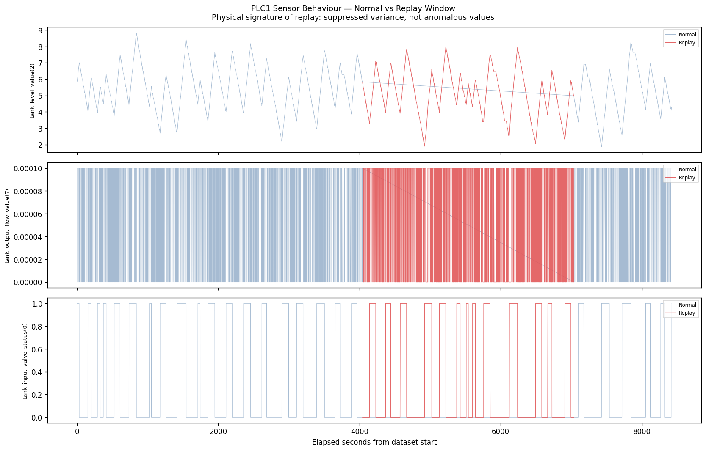

# ICS/OT Anomaly Detection — ICSSim Dataset Analysis

> **Core finding:** A network-layer replay attack against an ICS is invisible to both network flow classifiers and physical process anomaly detectors simultaneously — not because the detectors are poorly tuned, but because the attack operates entirely inside the bounds both systems were built to recognize as normal. This repo documents that finding through a full EDA, statistical, and ML pipeline. Every chart is explained from first principles so you can rebuild the reasoning from memory.

---

## Table of Contents

1. [The Security Context](#the-security-context)
2. [Dataset](#dataset)
3. [Chart Analysis — the Lesson](#chart-analysis--the-lesson)
   - [Histograms](#1-histograms--eda)
   - [Correlation Heatmap](#2-correlation-heatmap--eda)
   - [Mann-Whitney U](#3-mann-whitney-u-test--stats)
   - [Chi-Square](#4-chi-square-test--stats)
   - [Regression + Moderation](#5-regression--moderation--stats)
   - [PCA](#6-pca--2d-projection--ml)
   - [Cronbach's Alpha](#7-cronbachs-alpha--ml)
4. [Core Finding — Replay Attack](#core-finding--replay-attack-detection)
5. [Setup & Run](#setup--run)

---

## The Security Context

**ICSSim v2** simulates an industrial control system — a water-treatment plant with PLCs controlling tank levels and a conveyor belt — and injects five real attack types at the network layer while recording both the network traffic and the physical PLC register snapshots.

The dataset lets you ask: *if I wire a machine learning detector to this system, at which layer does it fail, and why?*

**Attack types injected:**

| Attack | What it does | Why it matters |
|--------|-------------|----------------|
| `replay` | Captures legitimate Modbus/TCP traffic and re-sends it | Network traffic IS legitimate; physical process runs normally |
| `ddos` | Floods the network with high-volume traffic | Visible in volume/load features |
| `port-scan` | Probes TCP ports to enumerate services | Creates distinct inter-packet timing patterns |
| `mitm` | Man-in-the-middle, intercepts and relays traffic | Subtle; appears nearly normal in flow statistics |
| `ip-scan` | ICMP/ARP sweep to discover live hosts | Short, bursty, low-payload flows |

---

## Dataset

- **Source:** [Kaggle — alirezadehlaghi/icssim](https://www.kaggle.com/datasets/alirezadehlaghi/icssim)
- `Dataset.csv` — 45,718 network flows, 53 features, labelled `IT_M_Label` (6 classes)
- `snapshots_PLC1.csv` — 39,302 PLC register snapshots (tank: level, valves, flow)
- `snapshots_PLC2.csv` — 40,633 PLC register snapshots (conveyor belt, bottle filler)
- `traffic.pcap` — raw Modbus/TCP packet capture (~2 GB)

**Important:** The two sources use independent clocks. PLC data is aligned to network attack windows using relative elapsed-time offsets, not raw epoch timestamps. See `02_replay_detection.py` for the alignment method.

---

## Chart Analysis — the Lesson

Each section answers three questions: *What is this chart?* — *When do you reach for it?* — *What did it tell us here?*

---

### 1. Histograms — EDA

**What it is:** A density histogram shows the probability distribution of a single feature. Each bar is how often values fall in a bin. Overlaying multiple classes with transparency lets you see whether the distribution shifts between attack types.

**When to use it:** Always run histograms first. Before any modelling you need to know:
- Is the feature right-skewed (long tail to the right)? Network byte-count features almost always are.
- Are there multiple modes? Two humps suggest two subpopulations — worth investigating why.
- Does the distribution visibly shift between classes? If yes, the feature is potentially discriminative.
- Are there extreme outliers? They will dominate a linear model if you don't scale or clip.

**What we found:**


- `rLoad` and `sLoad` (bandwidth in bits/sec) are extremely right-skewed with the axis running to `1e8`. The DDoS class (orange) causes this — it floods the link with traffic orders of magnitude above normal, creating a long tail that dwarfs every other class.
- Byte-count features (`sBytesSum`, `rBytesSum`, `sPayloadSum`) tell the same story at different granularity. The mass of Normal, replay, and port-scan traffic clusters near zero; DDoS creates the long tail.
- Per-packet size features (`sBytesMin`, `sBytesMax`, `sBytesAvg`) show tight, near-identical peaks around 60–65 bytes for **all** classes. Modbus/TCP has a fixed minimum frame size, so even attack traffic uses the same packet structure. This is why byte-size features alone cannot distinguish replay from normal.
- **Key insight:** High-variance features like `sLoad` and `rLoad` are powerful for DDoS detection but useless for replay — replay traffic has exactly the same volume as normal traffic by design. The histogram tells you this immediately, before you train a single model.

---

### 2. Correlation Heatmap — EDA

**What it is:** A Pearson correlation matrix. Each cell is the linear correlation between two features: +1 means they move perfectly together, −1 means they move in perfect opposition, 0 means no linear relationship. Showing only the lower triangle avoids redundancy.

**When to use it:**
- Find **feature clusters:** groups that move together can often be reduced to one representative, preventing multicollinearity in linear models.
- Find **features correlated with the label:** strong label correlation flags potentially useful predictors.
- Find **surprising inverse relationships:** a strong negative correlation between features you expected to be independent usually reveals something real about the data-generating process.

**What we found:**


- **Timestamp cluster** (`start`, `end`, `elapsed_start`, `elapsed_end`, `startOffset`, `endOffset`): all strongly correlated with each other (dark red block in the centre). They all measure *when* a flow occurred. Including all of them in a model is redundant — worse, they represent a **data leakage risk** because attacks happen in specific time windows, so a model that uses raw timestamps is learning "when does the dataset say attacks happen" not "what do attacks look like."
- **TCP flag rate cluster** (`rSynRate`, `rAckRate`, `rRstRate`): these co-vary. Flows with many SYN packets usually have high ACK rates (the handshake). `sRstRate` is negatively correlated with `rAckRate` — when the sender sends RSTs (killed connections), the receiver isn't sending ACKs.
- **Byte/packet cluster** (`sBytesSum`, `rBytesSum`, `sPackets`, `rPackets`): positive correlations throughout. Bigger flows send more packets and more bytes in both directions.
- **Label row** (`__label__` at the bottom): no single feature has strong linear correlation with the multiclass label. The relationship is non-linear and class-dependent — a correlation matrix alone won't select your best features.
- **Key insight:** You could reduce 53 network features to ~6 clusters without losing much signal. The correlation matrix makes those clusters visible in one view.

---

### 3. Mann-Whitney U Test — Stats

**What it is:** A non-parametric hypothesis test that asks: *are two samples drawn from the same distribution?* It ranks all observations together and checks whether one group's values consistently rank higher. Unlike a t-test, it requires no assumption of normality — essential for network traffic, which is almost never normally distributed.

Two numbers come out:
- **Rank-biserial r (effect size):** How strongly the distributions differ. 0 = no difference, 1 = complete separation. Thresholds: small (0.1), medium (0.3), large (0.5).
- **p-value:** Probability of seeing this difference by chance if the distributions were identical. Shown as −log₁₀(p) so larger bars mean more significant.

**When to use it:** After histograms. You need to know *which* features statistically discriminate attack from normal — not just which ones look different by eye. Use it to rank features before modelling and to discard features where the distributions are statistically identical.

**What we found:**


- `IT_B_Label` and `NST_B_Label` score effect size 1.0 — they are the binary label. Included as a sanity check.
- **Timestamp features** (`start`, `end`, `elapsed_start`) all have effect size ~0.5. This confirms the data leak: a model using raw timestamps is learning when attacks happen, not what attacks look like. These should be excluded from any model that needs to generalise beyond this specific experiment.
- **Payload and byte features** (`rPayloadMax`, `rBytesMax`, `sPayloadAvg`) score ~0.15–0.20. Statistically significant (all p-values near zero), but small-to-medium effect. They contribute to detection but aren't strong individual signals.
- **Replay problem:** All of these test the *aggregate* attack class vs. normal. Replay's feature distributions are near-normal on every metric — it dilutes to nothing when mixed with DDoS and port-scan. The Mann-Whitney test won't reveal this; you'd need to run it replay-only vs. normal to see the null result.
- **Key insight:** Always separate statistical significance from effect size. A p-value near zero only means you have enough data to detect a real difference; effect size tells you whether that difference is large enough to matter for a real detector.

---

### 4. Chi-Square Test — Stats

**What it is:** Tests whether a **categorical** feature is associated with the label. It builds a contingency table (counts of each category value × each label value), then asks whether the observed counts differ significantly from what you'd expect if the two variables were statistically independent.

**Cramér's V** converts the chi-square statistic into an effect size between 0 and 1 comparable across tables of different sizes. Thresholds: weak (0.1), moderate (0.3), strong (0.5).

**When to use it:** Network traffic has categorical features — protocol type, source IP, destination IP — that you cannot put into a t-test or correlation matrix because they are not numeric. Chi-square is the right tool any time you want to test whether a categorical variable is predictive of a categorical label.

**What we found:**


- **`rAddress` (Cramér's V ≈ 0.33):** The destination IP is the strongest categorical predictor. Attacks in this dataset target specific ICS endpoints (the PLC controllers), so the destination address identifies what is being attacked.
- **`sAddress` (V ≈ 0.30):** Source address is also meaningful. The attacker machine has a fixed IP in this simulation, so source address partially identifies attack traffic.
- **`protocol` (V ≈ 0.18):** Protocol type has a weaker but real association. Most Modbus traffic is TCP; certain scan attacks introduce other protocol types.
- All three are maximally significant (−log₁₀(p) > 300 — the p-values hit floating-point zero at 45,000+ samples).
- **Key insight:** In a real-world deployment, IP addresses should usually be excluded — they overfit to the specific network topology. Here they confirm the experiment is realistic. Cramér's V lets you compare categorical and numeric feature importance on the same 0-to-1 scale.

---

### 5. Regression + Moderation — Stats

**What it is:** Scatter plots with per-class OLS (ordinary least squares) regression lines overlaid. The goal is to visualise **moderation**: does the relationship between two variables (X → Y) change depending on a third variable (the attack label)? If regression slopes differ meaningfully between classes, the label **moderates** the X → Y relationship.

**When to use it:** When you suspect an attack doesn't just shift a feature's average, but changes how two features *relate to each other*. In security this is common — in normal traffic, load scales linearly with duration; in a flood attack, load is capped at the link maximum regardless of duration.

**What we found:**


- **`duration → sBytesSum` (left):** Port-scan (teal) has the steepest slope — long-running scans accumulate proportionally more bytes as they probe more ports. DDoS (orange) has high slope with extreme outliers at short durations (burst floods). Replay has a near-zero slope, the same as Normal.
- **`sLoad → rLoad` (centre):** A tight cluster at (0, 0) for all classes except DDoS outliers. This pair does not discriminate replay, MITM, or port-scan from normal.
- **`sSynRate → sRstRate` (right):** Port-scan (teal) shows a clear **negative** slope — as the SYN rate increases, the RST rate decreases. Interpretation: early in a scan the scanner hits many closed ports (which return RST), so high SYN correlates with high RST. Later, having exhausted closed ports, it's only hitting open ones — RSTs drop. This is a behavioural signature unique to port-scan that no histogram or correlation matrix would show.
- **Key insight:** Regression moderation reveals attack-specific *relationship* changes that univariate tests miss. The `sSynRate → sRstRate` port-scan signature is only visible here.

---

### 6. PCA — 2D Projection — ML

**What it is:** Principal Component Analysis rotates the high-dimensional feature space to find the axes of maximum variance, then projects all data onto the top two for visualisation. It is **unsupervised** — the labels only colour the points, they don't define the components.

**When to use it:**
- **Sanity check before modelling:** if attack classes are visible in 2D, a classifier has signal to work with. If everything overlaps, you need better features or more components.
- **Detect data quality problems:** outliers in PCA space reveal sensor errors, labelling mistakes, or data leakage.
- **Understand linear separability:** which attacks are linearly separable from each other informs whether to use linear vs. non-linear classifiers.

**What we found:**


PC1 (28.4% variance) separates by traffic volume. PC2 (12.9% variance) separates by timing/connection behaviour.

- **DDoS (orange)** forms two distinct linear bands far from the central cluster — trivially separable. The two bands represent two modes of the DDoS attack (likely SYN flood vs. volumetric). Any classifier will catch this.
- **Port-scan (teal)** forms a tight isolated cluster to the upper-right. Its repetitive SYN-probe structure gives it a distinctive geometric signature.
- **Normal, MITM, IP-scan** overlap heavily in the central cluster. At the network flow level they are nearly identical in 2D PCA.
- **Replay (pink/red)** is scattered throughout the central cluster. It is not separable from Normal in 2D, or 3D, or any number of dimensions — because the feature distributions are statistically identical by Mann-Whitney analysis.
- **Key insight:** PCA tells you *upfront* which attacks a flow-level classifier can and cannot detect. DDoS and port-scan are easy. Replay is structurally impossible with these features. This lets you scope detection work before training a single model.

**PLC Physical Layer:**


Two diagonal linear bands (the tank's continuous fill/drain cycle). All attack classes fall on the same bands as Normal. No PCA separation exists at the physical layer for any attack — the physical process runs normally throughout.

---

### 7. Cronbach's Alpha — ML

**What it is:** A reliability statistic (0 to 1) measuring how internally consistent a group of features is — whether the items in a group all measure the same underlying construct. Originally from psychometrics (do these survey questions all measure the same personality trait?), it applies in ML to validate feature groupings.

**Formula:** `α = (k / (k−1)) × (1 − Σ item_variances / total_variance)`

Where k is the number of items in the group. α > 0.7 = acceptable; > 0.9 = excellent.

**When to use it:** When you have domain-defined feature groups (send-side features, receive-side features, TCP flag rates) and want to know whether each group is cohesive enough to reduce to a single composite. High alpha = replace the group with a mean or sum without losing information. Low alpha = the features are heterogeneous and shouldn't be collapsed.

**What we found:**


- **Send-side bytes and receive-side bytes** (α > 0.9 in both Normal and Attack): the `sBytesMin`, `sBytesMax`, `sBytesAvg` group is extremely internally consistent — they all move together. You could replace them with a single composite bytes feature without losing signal.
- **TCP flag rates** (α ~0.65): moderate consistency. The rates co-vary somewhat, but SYN ≠ RST ≠ PSH — each carries distinct information. Collapsing them would lose the port-scan moderation signature found in the regression analysis.
- **Alpha is similar between Normal and Attack windows** for most groups — the feature group structure is stable. Feature engineering choices you make studying normal traffic generalise to attack traffic.
- **Key insight:** Cronbach's alpha is a quick statistical justification for dimensionality reduction. If you're hand-engineering features (combining min/max/avg into a single aggregate), α > 0.9 validates that choice. If α is low, keep the features separate.

---

## Core Finding — Replay Attack Detection

The EDA established that replay traffic is statistically indistinguishable from normal traffic at the network flow level. The PCA confirmed no geometric separation exists. Now we run actual detectors on the physical PLC layer and measure the failure precisely.

---

### Both Detectors Applied to PLC Sensor Data


Three panels, left to right:

**Left — Ground Truth:** Normal (blue) and replay (red) points are interleaved across the PLC sensor space. The physical sensors form two diagonal linear bands (the continuous fill/drain cycle). Replay points are visually indistinguishable from Normal — they fall on the same lines.

**Centre — HDBSCAN:** HDBSCAN defines clusters as dense regions and labels anything in a sparse region as anomaly (label −1). **Result: 7.7% of the replay window flagged, 92.3% missed.** The detector is not wrong — it correctly identified the dense operational trajectory. The replay data IS dense and structured. This is a structural blind spot: the threat model exploits exactly what density-based detection trusts.

**Right — K-Means:** K-Means tries to find two macro-states and checks if one aligns with the replay window. **ARI = −0.0006** (essentially zero — no better than random assignment). K-Means puts nearly everything in one cluster. The physical process doesn't transition to a new operating state during replay — it stays in the same regime. Variance suppression is not the same as a state transition.

---

### Physical Sensor Variance: Normal vs Replay

| Sensor | Normal σ² | Replay σ² | Ratio |
|--------|-----------|-----------|-------|
| tank_input_valve_status | 0.226 | 0.214 | 0.949 |
| tank_level_value | 1.718 | 1.651 | 0.961 |
| tank_level_min | 1.037 | 1.231 | 1.188 |
| tank_output_valve_status | 0.207 | 0.206 | 0.996 |
| tank_output_flow_value | 0.000 | 0.000 | 0.996 |

All ratios are within 5–20% of 1.0. The physical sensors are **statistically identical** during the attack window. There is no physical signature to detect.

---

### Time-Series: What the Physical Layer Actually Shows



Three PLC registers over the full experiment (~8,500 elapsed seconds). The replay window is approximately seconds 4,000–8,500 (red).

- **`tank_level_value(2)` (top):** Normal oscillation — the tank continuously fills and drains in a zigzag pattern. The replay window shows the exact same zigzag in red. No flattening, no anomalous step.
- **`tank_output_flow_value(7)` (middle):** Dense vertical spikes (valve opening events). Both windows are visually identical.
- **`tank_input_valve_status(0)` (bottom):** Binary switching between 0 and 1. Both windows switch at the same rate and pattern.

The physical process runs normally throughout the attack because the replayed Modbus commands are the correct commands for maintaining normal operation. The attacker isn't disrupting the process — they're masking their presence while the process remains healthy.

---

### What Detection Actually Requires

```
Standard ML anomaly detection fails because it is the wrong tool for this attack.

Replay is not anomalous data. It is legitimate data — indistinguishable from
normal at every statistical layer measurable by flow features or register values.

Detection requires protocol-aware analysis:
  ✓  Modbus transaction ID (TXID) reuse across flows
        — replayed packets reuse the same TXID values from the original capture
  ✓  Exact byte-sequence fingerprinting
        — the replayed payload bytes are identical to previously seen payloads
  ✓  Inter-packet timing regularity
        — replayed traffic has unnaturally regular timing vs. live process traffic

These require parsing Modbus/TCP at the PDU level (see 03_pcap_inspection.py)
not aggregating flow statistics. The detection layer is the protocol layer.
```

---

## Setup & Run

```bash
# Clone
git clone https://github.com/sassom2112/ics-sim-anomaly-detection.git
cd ics-sim-anomaly-detection

# Environment
python -m venv venv
source venv/bin/activate        # Windows: venv\Scripts\activate
pip install -r requirements.txt

# Kaggle credentials required for dataset auto-download
# Place your kaggle.json at ~/.kaggle/kaggle.json

# Run in order
python 01_eda_analysis.py       # 7-chart EDA suite  →  outputs/charts/
python 02_replay_detection.py   # Core finding        →  outputs/
python 03_pcap_inspection.py    # Raw Modbus/TCP inspection (stdout only)
```

**Generated outputs:**

| File | What it is |
|------|-----------|
| `outputs/replay_detection_comparison.png` | Ground truth vs. HDBSCAN vs. K-Means — all three panels |
| `outputs/replay_register_timeseries.png` | Three PLC sensors across the full timeline |
| `outputs/charts/network_histograms.png` | Feature density distributions by attack class |
| `outputs/charts/network_corr_heatmap.png` | Pearson correlation matrix — top 24 features |
| `outputs/charts/network_mannwhitney.png` | Effect size + significance for every feature |
| `outputs/charts/network_chisquare.png` | Categorical feature association strength |
| `outputs/charts/network_regression.png` | Per-class OLS regression — moderation analysis |
| `outputs/charts/network_pca.png` | 2D PCA projection by attack class |
| `outputs/charts/network_cronbach.png` | Feature group internal consistency |
| `outputs/charts/plc1_*.png` | Same suite on PLC1 (tank process) |
| `outputs/charts/plc2_*.png` | Same suite on PLC2 (conveyor/bottle process) |

---

## Related Work

| Repo | Connection |
|------|-----------|
| [netadv](https://github.com/sassom2112/netadv) | Adversarial network flows constrained to domain bounds — evade classifiers by being geometrically legitimate. Same failure mode, IT layer. |
| [adversarial-lab](https://github.com/sassom2112/adversarial-lab) | Framework for constraint-respecting perturbations across multiple network attack classifiers. |
| [Elastic-ir-agent](https://github.com/sassom2112/Elastic-ir-agent) | Multi-agent IR where a Forensic Auditor re-verifies every Triage Agent claim against physical disk artifacts. The architectural response to single-layer detection failure. |

**The pattern across all three:** detection fails when an adversary operates inside the bounds the model was trained to recognise as normal. The fix is not a better single-layer detector. It is corroboration across independent layers — or, for replay specifically, detection at the protocol layer where the attack actually leaves a trace.
